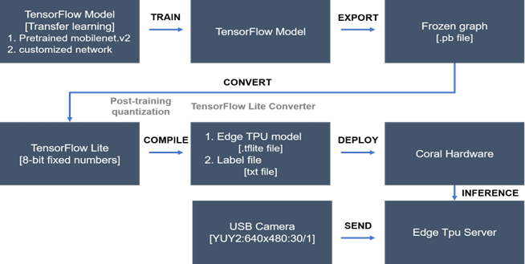

# Emergency Exit Detection for Visually Impaired People

## 🔍 Introduction

### Team Project in IoT @SeoulTech  
**Prof. Jin Woo Jeong**  

**Saerom Lee** (nrdk@ds.seoultech.ac.kr), **Dohyeon Lee** (skypo1000@ds.seoultech.ac.kr)  
Department of Data Science @SeoulTech  

This repository contains the source code for the **Emergency Exit Detection for Visually Impaired People** project, conducted as part of an IoT course at **Seoul National University of Science and Technology (SeoulTech)**.

### 📌 Motivation
According to the **World Health Organization (WHO)**, over **2.2 billion people** worldwide suffer from some form of visual impairment. Studies show that over **80% of information intake** is visual, making visually impaired individuals highly dependent on assistive technologies.  

Emergency evacuation methods rely heavily on **visual cues**, such as **bright green exit signs**, which are **inaccessible** to visually impaired individuals. In emergencies such as earthquakes and fires, **blind individuals struggle to locate exits**, making traditional evacuation methods **inadequate for their needs**.

While **object detection technologies** have been widely developed for **autonomous vehicles and general object recognition**, very few systems focus on detecting **indoor emergency exit signs**. This project **addresses this gap** by proposing a **real-time emergency exit detection system**.

### 🎯 Purpose
This project aims to develop an **AI-powered emergency exit detection system** to assist visually impaired individuals in **navigating indoor spaces safely**. The system:  
- Detects **emergency exit signs** using **deep learning-based object detection**.  
- Provides **real-time environmental awareness** for **safe evacuation**.  
- Uses **MobileNetV2** to ensure **fast and lightweight detection** for deployment on **mobile devices**.

## 🏗 System Architecture

The following diagram illustrates the model conversion and deployment process:

---

## ⚙️ Methodology

### 🏗 System Overview
1. **Emergency Exit Detection Model Training**  
   - Utilizes **Transfer Learning** based on a **pretrained model**.
   - **MobileNetV2** is used as the backbone model (pretrained on **ImageNet**).
   - The model is fine-tuned with **a custom indoor dataset** for emergency exit detection.

2. **Dataset Sources**
   - **Indoor Sign Dataset (ISD)**: Contains emergency exit and general indoor signage.
   - **Indoor Object Detection Dataset (IODD)**: Indoor object dataset for training robust models.
   - **Custom Images**: 21 images collected manually for additional testing.

3. **Classification Approach**
   - **Binary Classification**: Distinguishes between emergency exits and other signs.
   - **Multiclass Classification**: Further classifies emergency exits into subcategories:
     - **Exit Arrow** (with directional indicators)
     - **Exit Here** (no direction)
     - **Non-Exit**

4. **Data Preprocessing & Augmentation**
   - **Normalization:** Pixel values scaled to **1/255**.
   - **Resizing:** Images resized to **224x224**.
   - **Augmentations:**
     - **Binary Classification:** Horizontal/Vertical flips.
     - **Multiclass Classification:** Horizontal/Vertical flips, Brightness adjustments (0.7~1.3).

---

## 🧪 Experiment Design

### 📊 Dataset Composition
| Step  | Class                     | Train Data | Validation Data | Test Data |
|------|---------------------------|------------|----------------|------------|
| Step 1 | Emergency Exit vs. Other Signs (Binary Classification) | 600 (from 100), 590  | 47, 36  | 10, 10  |
| Step 2 | Exit Arrow, Exit Here, Non-Exit (Multiclass) | 1002 (from 65), 1002 (from 35), 590 | 25, 12, 36 | 37, 13, 324 |

### 🔢 Model Training Settings
- **Batch Size:** 64
- **Epochs:** 20
- **Evaluation Metric:** **AUROC**
- **Early Stopping:** Stops training if validation loss increases for **3 consecutive epochs**.

---

## 📈 Results

### 🎯 Model Performance
- **Step 1 (Binary Classification)**
  - **AUROC (Validation Data):** **0.95**
  - Loss **decreased**, AUROC **increased** consistently.

- **Step 2 (Multiclass Classification)**
  - **AUROC (Validation Data):** **0.9538**
  - Loss **increased**, AUROC **decreased** → Requires **more data**.

### 🔍 Model Prediction Performance (Confusion Matrix)
#### Step 1 (Binary Classification)
| Actual | Predicted: Emergency Exit | Predicted: Other Signs |
|--------|--------------------------|-----------------------|
| Emergency Exit | 10 | 0 |
| Other Signs | 1 | 9 |

#### Step 2 (Multiclass Classification)
| Actual | Predicted: Exit Arrow | Predicted: Exit Here | Predicted: Non-Exit |
|--------|----------------------|----------------------|----------------------|
| Exit Arrow | 43 | 3 | 1 |
| Exit Here | 4 | 14 | 0 |
| Non-Exit | 10 | 3 | 310 |

---

## 🚀 Inference & Deployment
- **Dataset:** 11 manually collected images.
- **Inference Speed:** ~140-150ms per image.
- **Inference Results:**
  - **Binary Classification:** Recognizes emergency exit signs **effectively**.
  - **Multiclass Classification:** Performance drops **if backgrounds include ceilings, walls, or windows**.

---

## 🔮 Future Work
- **Incorporating exit sign directionality** → Improve route guidance.  
- **Expanding dataset** → Mitigate data imbalance.  
- **Deploying lightweight models** → Adaptation for **mobile devices**.  

---
## 📜 References
- World Health Organization (WHO), "Visual Impairment and Blindness," 2021.
- M. Sandler et al., "MobileNetV2: Inverted Residuals and Linear Bottlenecks," CVPR, 2018.
- J. L. Almeida et al., "Indoor Sign Dataset (ISD): An Overview and Baseline Evaluation," VISAPP, 2019.
- B. Adhikari et al., "Faster bounding box annotation for object detection in indoor scenes," EUVIP, 2018.
- S. Chen et al., "Emergency Exit Detection for Visually Impaired People Using YOLOv5," IEEE, 2022.

